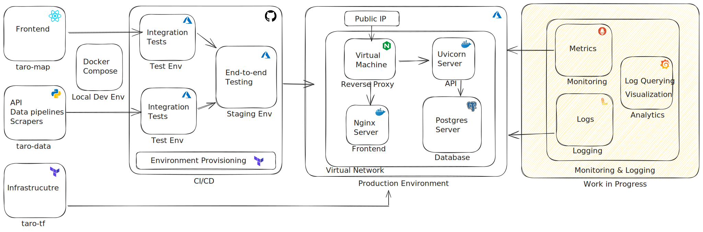
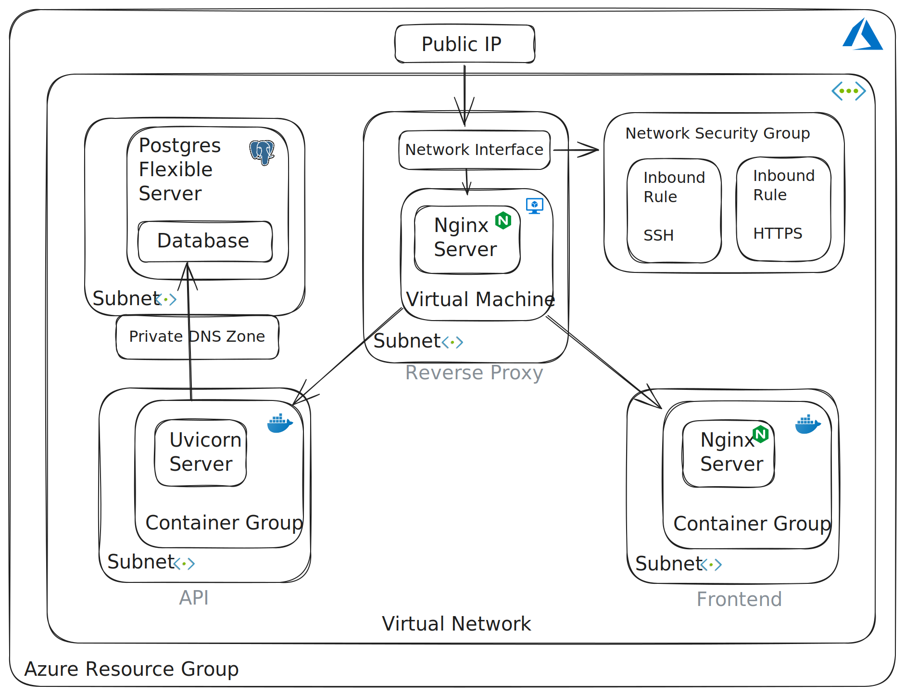

<h1> Arms-tracker </h1>

Welcome to arms-tracker, an interactive web-application visualising the flow of arms ex- and imports and the impact on global conflict.

You can visit the app at <a href=https://www.arms-tracker.app>www.arms-tracker.app</a>

The app is both a passion-project as well as a project for my portfolio. 
If you are interested in the deails on how I created and maintain this project, this is where you can find all the details. 
If you are only interested in the finished product, you can stop reading now.

<h1>Structure</h1>
This give a little idea about the structure of the project. The individual components are discussed below.
  

<h1>Repositories</h1>
The app consists of three repositiories, plus this very repo you are reading right now.
  

<b>TL;DR:</b>
- <a href=https://github.com/Kafkaese/taro-data>taro-data</a>: Backend.
- <a href=https://github.com/Kafkaese/taro-map>taro-map</a>: Frontend.
- <a href=https://github.com/Kafkaese/taro-tf>taro-tf</a>: Infrastructure.

<h2>Taro</h2>
This very repository that serves as dcoumentation and a landing page.

<h2><a href=https://github.com/Kafkaese/taro-data>Taro-data</a></h2>
This repository contains the backend of the arms-tracker app. This includes:

<h4>EDA Jupyter Notebooks</h4>
Every data  projects  starts with the collection and exploration of data. Here you can find EDA notebooks as well as notebooks containing the first code for data pipelines.
Since some of the additional data is scraped from Wikipedia, you can also find notebooks with web scrapers in this section.

<h4>API Code</h4>
The REST API was written in python using the <a href=https://fastapi.tiangolo.com/>FastAPI</a> package. It is served by a <a href=https://www.uvicorn.org/>Uvicorn Web Server</a>. The API serves as the interface between the <a href=https://www.postgresql.org/>Postgresql</a> Database and the Frontend. It contains various endpoints for get requests to retrieve data in a safe way and encapsulates the complexity of the sql queries. The whole API is containerized with <a href=https://www.docker.com/>Docker</a> for fast and easy deployment.

 <h4>Pipeline</h4>
 In order to get the raw data preprocessed into the Postgresql Database that the API queries, there are various data pipelines. They are in the form of a custom python package named 'taro'. This way they can easily be containerized and quickly run from said container.

 <h4>Tests</h4>
 In order to ensure a good devlopment workflow, the code for both the API, as well as the Pipelines, comes with a number of tests. The <a href=https://docs.pytest.org/en/7.4.x/>Pytest</a> package was used to write these. The tests are crucial for the CI workflow discussed later.

 <h4>Development Environment</h4>
 For local development there are a number of files for a convinient development environment. This includes a <a href=https://docs.docker.com/compose/>Docker Compose</a> configuration. 
The configuration consists of services for the API, a postgresql server and the pipelines. Optionally, a frontend container can be enabled, but it it often turned out to be more convinient to have the frontend run on a seperate development server.
 In order to be able to have ssl encryption in the development stage already, the neccesary files for this are also in this repository. This ssl certificate and key are locally trusted only and serve allow the development of ssl-encrypted content locally. The cerficate and key were created with <a href=https://github.com/FiloSottile/mkcert>mkcert</a>.

 <h4>Continious Integration</h4>
 Due to the microservice architecture of the appllication and the subsequent splitting of the code into several repositories, part of the CI pipeline is in this repository. Specifically, a Test Environment that is run every time a non-draft pull-request into the main branch of the taro-data respository is opened or synchronized. For this purpose a Github Actions workflow is used.
 The workflow uses <a href=https://www.terraform.io/>Terraform</a> to provision a Test Environment on <a href=https://www.terraform.io/>Microsoft Azure</a>. This includes:
   

 - A Resource Group.
 - A Container Registry. 
 - A Postgresql Flexible Server
 - A Container Group

After the environment has been provisioned, the images for the API and the Data Pipelines are build and pushed to the container registry and the Pipeline is run.  Then the  Container Group starts an instance of the API image and the tests can be run. In a final step, no matter what the outcome of any previous  steps, the Test Environment is destroyed. This is in  order to minimize the costs of the infrastructure. 
 
<h2><a href=https://github.com/Kafkaese/taro-map>Taro-map</a></h2>
This repository contains the frontend of the arms-tracker app. 

<h4>React.js Application</h4>
The frontend was written in javascript using the <a href=https://react.dev/>React Frameworl</a>. It is containerized with Docker and served by an <a href=https://nginx.org/en/>Nginx<a> web server.</a>

 <h4>Continious Integration</h4>
Similarily to the backend repository, the frontend repository also contains some elements of the CI pipeline. Again, a Test Workflow, using Github Actions, is run every time a non-draft pull-request into the main branch of the taro-map respository is opened or synchronized.
The workflow uses <a href=https://www.terraform.io/>Terraform</a> to provision a Test Environment on <a href=https://www.terraform.io/>Microsoft Azure</a>, which includes:
    

After the environment has been provisioned, the image for the frontend is build and pushed to the container registry. Then the Container Group starts an instance of the Frontend image and the tests can be run. In a final step, no matter what the outcome of any previous steps, the Test Environment is destroyed.

<h2><a href=https://github.com/Kafkaese/taro-tf>Taro-tf</a></h2>
Repository containing Terraform IaaC for provisioning the production environment on Microsoft Azure. The structure of the infrastructure is visualized in the following graph.
  

The indiviudal components of the infrastructure are listed below:

<h4>Resource Group, Storage, Registry and Network</h4>
All resources on Azure must  be part of a Resource Group, so the production environment has a dedicated Resource Group. 
Part of the Resource Group is a Storage Account, that stores the backend for all the Terraform Configurations, including the one for the production environment. 
For this reason the Resource Group  and the Storage Account are marked as indestructible.
   
A dedicated Virtual Network for the prodcution environment is also created, as well as a Container Registry for all docker images needed.
  
<h4>Postgres Server</h4>
An Azure Postgresql Flexible Server. The server is initiated with a database for the backend. It also comes with a private DNS zone that assigns a FQDN within the Virtual Network to the Postgres Server. 
The server has a dedicated Subnet with a servide delegation to 'Azure Postgres Flexible Server'.  

<h4>API and Data Pipeline</h4>
The API and the Data Pipeline are both containerized and deployed as part of a Container Group. The Data Pipeline is deployed as an init container that is run exactly once during creation of the Container Group. Then the API container is deployed in the same Container Group. The API container runs a Uvicorn server, serving a FastAPI application.
Like most resources, the Container Group has a dedicated Subnet with a service delegation.

<h4>Frontend</h4>
The React frontend is also containerized and deployed in a dedicated Container Group, again with its own subnet with a service delegation.  The container runs an Nginx webserver that serves the built React application.

<h4>Reverse Proxy</h4>
The Application is reachable via a single public IP address that has a number of DNS records on Google Domains. The public IP is associated with a Network Interface connected to a Virtual Machine.
The Virtual Machine runs an Nginx Reverse Proxy Server. The server is configured to listen on the 443 HTTPS port. For this purpose the ssl certificate and keychain are stored on the VM. The certifcate is valid for arms-tracker.app as well as api.arms-tracker.app, so all traffic is ssl encrypted.
The Network Interface has a Network Security Group attached, with Inbound Rules for HTTPS for regular encrypted traffic to the API and the Frontend, and also for SSH for development and maintenance purposes.
The reverse proxy server is configured to send traffic to arms-tracker.app to the Frontend Container Groups private IP. All traffic to api.arms-tracker.app is directed to the API Container Groups private IP. 

<h2>Staging Environment</h2>
The staging environment is currently being re-worked, to more closely resemble the final production environment. There is still code for the older, currently inactive staging environment in the repositories. These include github action workflows and terraform configurations. In the future you will find more information here.

<h2>Roadmap / Future</h2>
There are many more features I want to implement in the future, both in terms of app features, as well as additions to the infrastracture. Here is a list of future to-dos, roughly in order of priority.
   

- Staging Environment (see above)
- Continous Deployment
- Monitoring and Logging (see also structure diagram)
- Additional app features, including:
  - Linking currently ongoing armed conflicts to arms im- and exports
  -   Include more data about relative importance of the military in a nations economy, e.g military budget as percentage of GDP

<h2>Contributing</h2>
If you are interested in contributing to the project there are several ways:
   

- Open an issue about a bug you found or a feature/enhancement you would like to suggest
- Pick an open issue and fix it. 
- Start coding and make a PR with your enhancement.

All the code is open source. I greatly appreciate any input and help!

<h2>Why taro?</h2>
<a href=https://en.wikipedia.org/wiki/Gerda_Taro>Gerda Taro</a> was a war photographer during the Spanish Civil War. She was immortalized in the Song Taro by indie band Alt-J. 
A taro is also a root vegetable not too dissimilar to a potato, but that is neither here nor there.
